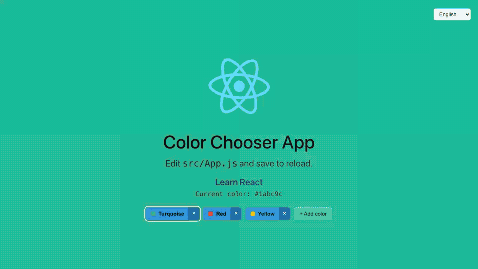

<div align="center">

# Test Automation Best Practices

**The definitive reference for production-grade test automation engineering.**

_29 battle-tested patterns — from unit testing to security scanning — in a single, runnable full-stack project._

[](https://github.com/jpourdanis/test-automation-best-practices/actions/workflows/ci.yml)
[](https://coveralls.io/github/jpourdanis/test-automation-best-practices?branch=main)
[](https://sonarcloud.io/summary/new_code?id=jpourdanis_test-automation-best-practices)
[](https://sonarcloud.io/summary/new_code?id=jpourdanis_test-automation-best-practices)
[](https://sonarcloud.io/summary/new_code?id=jpourdanis_test-automation-best-practices)
[](https://sonarcloud.io/summary/new_code?id=jpourdanis_test-automation-best-practices)
[](https://jpourdanis.github.io/test-automation-best-practices/)
[](https://jpourdanis.github.io/test-automation-best-practices/)



[Live Allure Report](https://jpourdanis.github.io/test-automation-best-practices/) · [Live Demo](https://test-automation-best-practices.vercel.app) · [Report a Bug](https://github.com/jpourdanis/test-automation-best-practices/issues)

</div>

---

## Why this repository exists

Most tutorials show you how to write _a_ test. This repository shows you how to build a _test suite_ — one that scales with your team, survives production incidents, and stays maintainable after hundreds of commits.

Every pattern here solves a real problem that teams hit in production:

| Pattern            | The problem it solves                                               |
| ------------------ | ------------------------------------------------------------------- |
| Page Object Model  | Selector changes in one place, not 50 files                         |
| Hybrid E2E         | Slow, flaky UI setup replaced with sub-millisecond API calls        |
| E2E Code Coverage  | 500 UI tests with 40% coverage means blind spots you can't see      |
| Mutation Testing   | 100% line coverage that still misses bugs — coverage ≠ confidence   |
| Testcontainers     | Mock databases lie; real containers don't                           |
| Security E2E Tests | Scanners find known CVEs; these tests verify your own defences fire |

---

## Tech stack

| Layer            | Technology                                             |
| ---------------- | ------------------------------------------------------ |
| Frontend         | React 19, TypeScript, react-i18next (EN / ES / EL)     |
| Backend          | Express 5, Mongoose 9, Zod, Swagger                    |
| Database         | MongoDB                                                |
| E2E              | Playwright, playwright-bdd (Cucumber), Allure          |
| Unit / Component | Jest, React Testing Library, Supertest                 |
| Integration      | Testcontainers (real MongoDB in Docker)                |
| Performance      | k6 (API load + browser UI tests)                       |
| Mutation         | Stryker Mutator                                        |
| Security         | Trivy, npm audit, Playwright security suite            |
| CI/CD            | GitHub Actions, Docker Compose, Vercel Preview         |
| Quality Gates    | SonarCloud, Coveralls, NYC (80% threshold), MegaLinter |

---

## Table of Contents

- [Architecture](#architecture)
- [Quick Start](#quick-start)
- [Running Tests](#running-tests)
- [Best Practices](#best-practices)
  - [Part 1 — Core Framework & Test Design](#part-1--core-framework--test-design)
  - [Part 2 — Comprehensive Test Coverage](#part-2--comprehensive-test-coverage)
  - [Part 3 — CI/CD & Execution Strategy](#part-3--cicd--execution-strategy)
  - [Part 4 — Quality Gates & Reporting](#part-4--quality-gates--reporting)
- [Project Structure](#project-structure)
- [Contributing](#contributing)

---

## Architecture

```
┌─────────────────────────────────────────────────────────────────┐
│                        Docker Compose                           │
│                                                                 │
│  ┌─────────────┐    ┌──────────────────┐    ┌───────────────┐  │
│  │  Frontend   │───▶│   Backend API    │───▶│    MongoDB    │  │
│  │  React 19   │    │   Express 5      │    │   (colorsdb)  │  │
│  │  Port 3000  │    │   Port 5001      │    │   Port 27017  │  │
│  └─────────────┘    └──────────────────┘    └───────────────┘  │
│                                                                 │
│  ┌─────────────────────────────────────────────────────────┐   │
│  │   Playwright  ──▶  app:3000    k6  ──▶  api:5001        │   │
│  └─────────────────────────────────────────────────────────┘   │
└─────────────────────────────────────────────────────────────────┘
```

**Frontend** (`src/`) — React 19 + TypeScript color-picker. On load it fetches `/api/colors`, renders each as a button, and updates the header background color on click. Instrumented with `babel-plugin-istanbul` for E2E coverage collection.

**Backend** (`server/`) — Express 5 REST API. Zod validates every request body. Mongoose persists to MongoDB. Swagger serves the OpenAPI spec at `/api-docs`. Seeds three default colors (Turquoise, Red, Yellow) on startup.

**API endpoints:**

| Method   | Endpoint            | Description                |
| -------- | ------------------- | -------------------------- |
| `GET`    | `/api/colors`       | List all colors            |
| `GET`    | `/api/colors/:name` | Get a single color by name |
| `POST`   | `/api/colors`       | Create a new color         |
| `PUT`    | `/api/colors/:name` | Update an existing color   |
| `DELETE` | `/api/colors/:name` | Delete a color             |

---

## Quick Start

### Prerequisites

- Node.js 18+
- Docker

### Install

```bash
# Frontend
npm install
npx playwright install

# Backend
cd server && npm install && cd ..
```

### Run the full stack

```bash
docker compose up -d
```

> [!IMPORTANT]
> **Local Docker prerequisite — remove BuildKit cache mounts.**
> The `Dockerfile` and `server/Dockerfile` use `--mount=type=cache` which is CI-only. Before running locally, replace those `RUN` lines:
>
> ```dockerfile
> # Remove this CI-only line:
> RUN --mount=type=cache,target=/root/.npm npm ci --legacy-peer-deps
>
> # Replace with:
> RUN npm ci --legacy-peer-deps
> ```

> [!TIP]
> **Colima users** — create `.docker-local/config.json` in the project root:
>
> ```json
> { "DOCKER_HOST": "unix:///Users/your-user/.colima/default/docker.sock" }
> ```

---

## Running Tests

```bash
# All E2E tests (auto-starts Docker stack)
npx playwright test

# Individual suites
npx playwright test e2e/tests/a11y.spec.ts
npx playwright test e2e/tests/security.spec.ts
npx playwright test --headed                     # Watch the browser

# BDD / Cucumber
npm run test:bdd

# Unit & component tests
npm run test:unit

# Backend unit tests
cd server && npm test

# Integration tests (requires Docker)
cd server && npm run test:int

# Visual regression (Docker — consistent rendering)
npm run test:e2e:docker
npm run test:e2e:docker:update     # Regenerate baselines

# Cross-browser (Chrome + Firefox + Safari)
npm run test:cross-browser

# Performance (k6)
npm run test:perf:api:smoke
npm run test:perf:ui:load

# Coverage report + gate (80% threshold)
npm run coverage
npm run coverage:check

# Mutation testing (70% threshold)
cd server && npm run mutation
```

---

## Best Practices

### Part 1 — Core Framework & Test Design

---

#### 1. Page Object Model (POM)

**Files:** [`e2e/pages/HomePage.ts`](/e2e/pages/HomePage.ts) · [`e2e/baseFixtures.ts`](/e2e/baseFixtures.ts) · [`e2e/tests/pom-refactored.spec.ts`](/e2e/tests/pom-refactored.spec.ts)

**The problem:** Selectors hardcoded across 50 test files. One UI redesign breaks dozens of tests — you spend days hunting them down.

**The solution:** Define every selector once inside a class. Register it as a Playwright fixture so tests get a pre-wired instance, no manual `new` calls needed.

**Why it matters:**

- One selector change = one file change
- Tests read like user stories: `homePage.clickColorButton('Red')` is immediately understood by non-engineers
- Fixtures eliminate boilerplate `beforeEach(() => new HomePage(page))` blocks

```typescript
// e2e/pages/HomePage.ts
import { Page, Locator } from '@playwright/test'

export class HomePage {
  readonly page: Page
  readonly header: Locator
  readonly currentColorText: Locator
  readonly turquoiseBtn: Locator
  readonly redBtn: Locator
  readonly yellowBtn: Locator
  readonly addColorBtn: Locator
  readonly pickerCard: Locator
  readonly confirmCard: Locator
  readonly confirmDeleteBtn: Locator

  constructor(page: Page) {
    this.page = page
    this.header = page.locator('header')
    this.currentColorText = page.getByText('Current color:')
    // Exact aria-label prevents matching the chip-x "Remove color: X" buttons
    this.turquoiseBtn = page.getByRole('button', { name: 'Change background to Turquoise', exact: true })
    this.redBtn = page.getByRole('button', { name: 'Change background to Red', exact: true })
    this.yellowBtn = page.getByRole('button', { name: 'Change background to Yellow', exact: true })
    this.addColorBtn = page.getByRole('button', { name: '+ Add color', exact: true })
    this.pickerCard = page.locator('.picker-card')
    this.confirmCard = page.locator('.confirm-card')
    this.confirmDeleteBtn = page.getByRole('button', { name: 'Delete', exact: true })
  }

  async goto() {
    await this.page.goto('/')
  }

  async clickColorButton(colorName: string) {
    await this.page.locator('button.chip-main', { hasText: colorName }).click()
  }

  async clickDeleteChip(colorName: string) {
    await this.page.getByRole('button', { name: `Remove color: ${colorName}`, exact: true }).click()
  }
}
```

```typescript
// e2e/baseFixtures.ts — register once, use everywhere
export const test = baseTest.extend<{ homePage: HomePage; allureBddMapper: void }>({
  homePage: async ({ page }, use) => {
    await use(new HomePage(page))
  }
  // ... coverage collection and logging fixtures
})
```

```typescript
// e2e/tests/pom-refactored.spec.ts
import { test, expect } from '../baseFixtures'
import { convertHexToRGB } from '../helper'

const colors = [
  { name: 'Turquoise', hex: '1abc9c' },
  { name: 'Red', hex: 'e74c3c' },
  { name: 'Yellow', hex: 'f1c40f' }
]

test.describe('POM Refactored: Background color tests', () => {
  test.beforeEach(async ({ homePage }) => {
    await homePage.goto()
  })

  for (const color of colors) {
    test(`verify ${color.name} (#${color.hex}) is applied as the background color`, async ({ homePage }) => {
      await homePage.clickColorButton(color.name)
      await expect(homePage.currentColorText).toContainText(color.hex)

      const rgb = convertHexToRGB(`#${color.hex}`)
      await expect(homePage.header).toHaveCSS('background-color', `rgb(${rgb.red}, ${rgb.green}, ${rgb.blue})`)
    })
  }
})
```

```bash
npx playwright test e2e/tests/pom-refactored.spec.ts
```

---

#### 2. Behavior-Driven Development (BDD) with Cucumber

**Files:** [`e2e/features/home.feature`](/e2e/features/home.feature) · [`e2e/features/error-handling.feature`](/e2e/features/error-handling.feature) · [`e2e/features/i18n.feature`](/e2e/features/i18n.feature) · [`e2e/tests/bdd.spec.ts`](/e2e/tests/bdd.spec.ts)

**The problem:** Automated tests are written in TypeScript that Product Managers, Business Analysts, and QA leads cannot read. Requirements and tests drift apart silently.

**The solution:** Express tests in plain English (Gherkin) using `playwright-bdd` to compile `.feature` files into native Playwright tests. Three feature files cover distinct areas: background color theming, API error resilience, and language switching.

**Why it matters:**

- **Living documentation** — feature files are the executable source of truth for requirements; they can't go stale
- **Improved collaboration** — PMs can write or review scenarios without touching TypeScript
- **Reusability** — step definitions reuse the same Page Object Models as regular tests

```gherkin
# e2e/features/home.feature
@epic:UI_Components
@feature:Theming
Feature: Home Page Background Color
  As a user
  I want to change the background color
  So that I can customize my viewing experience

  @story:Background_Color_Customization
  @severity:normal
  @jira:UI-456
  Scenario Outline: Change background color
    Given I am on the home page
    When I click the "<color>" color button
    Then the active color text should be "<hex>"
    And the background color should be "<rgb>"

    Examples:
      | color     | hex     | rgb               |
      | Turquoise | #1abc9c | rgb(26, 188, 156) |
      | Red       | #e74c3c | rgb(231, 76, 60)  |
      | Yellow    | #f1c40f | rgb(241, 196, 15) |
```

```typescript
// e2e/tests/bdd.spec.ts — step definitions
const { Given, When, Then } = createBdd()
let homePage: HomePage

Given('I am on the home page', async ({ page }) => {
  homePage = new HomePage(page)
  await homePage.goto()
})

When('I click the {string} color button', async ({}, color: string) => {
  await homePage.clickColorButton(color)
})

Then('the active color text should be {string}', async ({}, hex: string) => {
  await expect(homePage.currentColorText).toContainText(hex)
})

Then('the background color should be {string}', async ({}, rgb: string) => {
  await expect(homePage.header).toHaveCSS('background-color', rgb)
})

// Error-handling steps — mock must be registered before navigation
Given('the API returns a server error for the colors list', async ({ page }) => {
  await page.route('**/api/colors', (route) => route.fulfill({ status: 500 }))
})

// i18n steps
When('I select the language {string}', async ({}, code: string) => {
  await homePage.page.selectOption('select', code)
})

Then('the {string} button label should be {string}', async ({}, _color: string, label: string) => {
  await expect(homePage.page.locator('button.chip-main', { hasText: label })).toBeVisible()
})
```

```bash
npm run test:bdd
```

---

#### 3. Avoiding Static Waits

**File:** [`e2e/tests/visual.spec.ts`](/e2e/tests/visual.spec.ts)

**The problem:** `page.waitForTimeout(2000)` has two failure modes — too short on a slow CI runner, too long on a fast local machine. The test becomes non-deterministic.

**The solution:** Synchronise against the actual network event with `waitForResponse`. It resolves the moment the response arrives — no wasted time, no false failures.

```typescript
// e2e/tests/visual.spec.ts
test('should display all core elements and handle button interaction', async ({ homePage, page }) => {
  await expect(homePage.header).toBeVisible()
  await expect(homePage.turquoiseBtn).toBeVisible()
  await expect(homePage.redBtn).toBeVisible()
  await expect(homePage.yellowBtn).toBeVisible()

  // ✅ Register listener BEFORE the action — deterministic, no static waits
  const responsePromise = page.waitForResponse(
    (resp) => resp.url().includes('/api/colors/Yellow') && resp.status() === 200
  )
  await homePage.clickColorButton('Yellow')
  await responsePromise

  await expect(homePage.currentColorText).toContainText('#f1c40f')
  await expect(homePage.header).toHaveCSS('background-color', 'rgb(241, 196, 15)')
})
```

> [!NOTE]
> Always register `waitForResponse` **before** the action that triggers the request. Playwright sets up the listener first; the click fires second.

---

#### 4. Data-Driven Testing

**File:** [`e2e/tests/data-driven.spec.ts`](/e2e/tests/data-driven.spec.ts)

**The problem:** Testing three colors by copy-pasting the same test block three times. Add a fourth color and you have four places to maintain the same assertion logic.

**The solution:** Define data once, loop to generate tests. Adding a new case is one line in the data array.

```typescript
// e2e/tests/data-driven.spec.ts
import { test, expect } from '../baseFixtures'

const testData = [
  { name: 'Turquoise', expectedHex: '#1abc9c', expectedRgb: 'rgb(26, 188, 156)' },
  { name: 'Red', expectedHex: '#e74c3c', expectedRgb: 'rgb(231, 76, 60)' },
  { name: 'Yellow', expectedHex: '#f1c40f', expectedRgb: 'rgb(241, 196, 15)' }
]

test.describe('Data-Driven Testing', () => {
  test.beforeEach(async ({ homePage }) => {
    await homePage.goto()
  })

  for (const data of testData) {
    test(`changing color to ${data.name} should reflect in UI and DOM`, async ({ homePage }) => {
      await homePage.clickColorButton(data.name)
      await expect(homePage.currentColorText).toContainText(data.expectedHex)
      await expect(homePage.header).toHaveCSS('background-color', data.expectedRgb)
    })
  }
})
```

```bash
npx playwright test e2e/tests/data-driven.spec.ts
```

---

#### 5. Random Data Generation with faker.js

**File:** [`e2e/tests/random-data.spec.ts`](/e2e/tests/random-data.spec.ts)

**The problem:** Hardcoded color names collide when tests run in parallel against a shared database. Static data never exercises edge cases like special characters or very long strings.

**The solution:** Generate unique, realistic data at runtime with `@faker-js/faker`. Randomness naturally discovers edge cases over repeated runs.

```typescript
// e2e/tests/random-data.spec.ts
import { test, expect } from '../baseFixtures'
import { faker } from '@faker-js/faker'

test.describe('Random Data Testing with faker.js', () => {
  let createdColorName: string | null = null

  test.afterEach(async ({ request }) => {
    if (createdColorName) {
      await request.delete(`/api/colors/${createdColorName}`).catch(() => {})
      createdColorName = null
    }
  })

  test('should create dynamic random color via API and verify through UI', async ({ homePage, page, request }) => {
    const randomColorName = faker.string.alphanumeric(15)
    const randomHex = faker.color.rgb({ format: 'hex' })
    const newColor = { name: randomColorName, hex: randomHex }
    createdColorName = newColor.name

    // 1. Arrange — API setup, no UI needed
    const createResponse = await request.post('/api/colors', { data: newColor })
    expect(createResponse.ok()).toBeTruthy()

    // 2. Act — navigate and interact with the UI
    await homePage.goto()
    const customBtn = page.getByRole('button', {
      name: `Change background to ${newColor.name}`,
      exact: true
    })
    const responsePromise = page.waitForResponse(
      (resp) => resp.url().includes(`/api/colors/${encodeURIComponent(newColor.name)}`) && resp.status() === 200
    )
    await customBtn.click()
    await responsePromise

    // 3. Assert
    await expect(homePage.currentColorText).toContainText(newColor.hex)
  })
})
```

```bash
npx playwright test e2e/tests/random-data.spec.ts
```

---

### Part 2 — Comprehensive Test Coverage

---

#### 6. Unit & Component Testing

**Files:** [`src/App.test.tsx`](/src/App.test.tsx) · [`src/ColorPicker.test.tsx`](/src/ColorPicker.test.tsx) · [`src/ConfirmDialog.test.tsx`](/src/ConfirmDialog.test.tsx) · [`server/index.test.js`](/server/index.test.js)

**The problem:** Relying solely on E2E tests creates a slow, top-heavy suite. When a complex E2E test fails, it's hard to know whether a pure function, a component, or the network caused it.

**The solution:** Test the smallest units in isolation — pure functions and React components — without a browser, network, or database. Hundreds of unit tests complete in seconds.

**Why it matters:**

- When a unit test fails you know _exactly_ which function is broken — no ambiguity about network or database
- Edge cases handled at this layer stay out of the E2E suite entirely
- Forms the base of the Test Automation Pyramid — the faster the base, the faster the whole pipeline

```typescript
// src/ColorPicker.test.tsx — pure-function coverage across all HSL sectors
import { hslToRgb, rgbToHex, hexToRgb, rgbToHsl, readableOn } from './ColorPicker'

describe('hslToRgb', () => {
  test('hue=0 (red) → [255,0,0]', () => expect(hslToRgb(0, 1, 0.5)).toEqual([255, 0, 0]))
  test('hue=30 (orange) → [255,128,0]', () => expect(hslToRgb(30, 1, 0.5)).toEqual([255, 128, 0]))
  test('hue=60 (yellow) → [255,255,0]', () => expect(hslToRgb(60, 1, 0.5)).toEqual([255, 255, 0]))
  test('hue=120 (green) → [0,255,0]', () => expect(hslToRgb(120, 1, 0.5)).toEqual([0, 255, 0]))
  test('hue=180 (cyan) → [0,255,255]', () => expect(hslToRgb(180, 1, 0.5)).toEqual([0, 255, 255]))
  test('hue=240 (blue) → [0,0,255]', () => expect(hslToRgb(240, 1, 0.5)).toEqual([0, 0, 255]))
})

describe('readableOn', () => {
  test('dark text on light background', () => expect(readableOn('#ffffff')).toBe('#111'))
  test('light text on dark background', () => expect(readableOn('#000000')).toBe('#fff'))
})
```

```typescript
// src/ConfirmDialog.test.tsx — keyboard & ARIA coverage
import { render, screen, fireEvent } from '@testing-library/react'
import { ConfirmDialog } from './ConfirmDialog'

function makeProps(overrides = {}) {
  return {
    title: 'Delete color?',
    body: 'Are you sure you want to delete Red?',
    swatch: '#e74c3c',
    confirmLabel: 'Delete',
    cancelLabel: 'Cancel',
    busy: false,
    onConfirm: jest.fn(),
    onCancel: jest.fn(),
    ...overrides,
  }
}

test('dialog has correct ARIA attributes', () => {
  render(<ConfirmDialog {...makeProps()} />)
  const dialog = screen.getByRole('alertdialog')
  expect(dialog).toHaveAttribute('aria-modal', 'true')
})

test('Escape key calls onCancel when not busy', () => {
  const onCancel = jest.fn()
  render(<ConfirmDialog {...makeProps({ onCancel })} />)
  fireEvent.keyDown(globalThis as unknown as Window, { key: 'Escape' })
  expect(onCancel).toHaveBeenCalledTimes(1)
})

test('Enter key calls onConfirm when not busy', () => {
  const onConfirm = jest.fn()
  render(<ConfirmDialog {...makeProps({ onConfirm })} />)
  fireEvent.keyDown(globalThis as unknown as Window, { key: 'Enter' })
  expect(onConfirm).toHaveBeenCalledTimes(1)
})
```

```bash
npm run test:unit          # React components
cd server && npm test      # Express API
```

---

#### 7. Hybrid E2E Testing

**File:** [`e2e/tests/hybrid.spec.ts`](/e2e/tests/hybrid.spec.ts)

**The problem:** Clicking through the UI to create the test data needed for a "verify color change" test is slow and exposes the test to flakiness in areas that aren't the actual focus.

**The solution:** Use the `request` fixture for the _Arrange_ phase (API calls, sub-millisecond), the browser for the _Act_ phase (UI interactions), and API calls again for _Teardown_. Touch the UI only for what you're testing.

```typescript
// e2e/tests/hybrid.spec.ts
import { test, expect } from '../baseFixtures'
import { faker } from '@faker-js/faker'

test.describe('Hybrid E2E Testing', () => {
  let createdColorName: string | null = null

  test.afterEach(async ({ request }) => {
    if (createdColorName) {
      await request.delete(`/api/colors/${createdColorName}`).catch(() => {})
      createdColorName = null
    }
  })

  test('should create color via API and verify through UI', async ({ homePage, page, request }) => {
    const uniqueName = faker.string.alphanumeric(15)
    const newColor = { name: uniqueName, hex: '#8e44ad' }
    createdColorName = newColor.name

    // 1. Arrange — fast state setup via API
    const createResponse = await request.post('/api/colors', { data: newColor })
    expect(createResponse.ok()).toBeTruthy()

    // 2. Act — navigate to the UI which now reflects the new state
    await homePage.goto()
    const customBtn = page.getByRole('button', {
      name: `Change background to ${newColor.name}`,
      exact: true
    })
    const responsePromise = page.waitForResponse(
      (resp) => resp.url().includes(`/api/colors/${newColor.name}`) && resp.status() === 200
    )
    await customBtn.click()
    await responsePromise

    // 3. Assert — UI reflects state correctly
    await expect(homePage.currentColorText).toContainText(newColor.hex)
    await expect(homePage.header).toHaveCSS('background-color', 'rgb(142, 68, 173)')
  })
})
```

---

#### 8. Network Mocking & Interception

**Files:** [`e2e/tests/network-mocking.spec.ts`](/e2e/tests/network-mocking.spec.ts) · [`e2e/tests/error-handling.spec.ts`](/e2e/tests/error-handling.spec.ts)

**The problem:** It's nearly impossible to test how the UI handles a `500 Internal Server Error`, a 404, or a missing image when connected to a real, functioning database.

**The solution:** `page.route()` intercepts requests before they leave the browser. Fulfill with mocked data, abort to simulate failures, or return specific status codes on demand.

> [!IMPORTANT]
> Always register `page.route()` **before** the navigation or action that triggers the request.

```typescript
// e2e/tests/network-mocking.spec.ts
import { test, expect } from '../baseFixtures'
import enTranslations from '../../src/locales/en.json'

test.describe('Network Mocking & Interception', () => {
  test('should handle missing image gracefully by showing alt text', async ({ homePage, page }) => {
    await page.route('**/logo.svg', (route) => route.abort())
    await homePage.goto()

    const logoImg = page.getByRole('img', { name: 'logo' })
    await expect(logoImg).toBeVisible()
    await expect(logoImg).toHaveAttribute('alt', 'logo')
  })

  test('should display colors that do not exist in the database', async ({ homePage, page }) => {
    await page.route('**/api/colors', async (route) => {
      await route.fulfill({
        status: 200,
        contentType: 'application/json',
        body: JSON.stringify([{ name: 'Magenta', hex: '#ff00ff' }])
      })
    })
    await page.route('**/api/colors/Magenta', async (route) => {
      await route.fulfill({
        status: 200,
        contentType: 'application/json',
        body: JSON.stringify({ name: 'Magenta', hex: '#ff00ff' })
      })
    })
    await homePage.goto()

    const customBtn = page.getByRole('button', { name: 'Change background to Magenta', exact: true })
    await expect(customBtn).toBeVisible()
    await customBtn.click()
    await expect(homePage.header).toHaveCSS('background-color', 'rgb(255, 0, 255)')
  })

  test('should gracefully handle a color not found in the database', async ({ homePage, page }) => {
    await page.route('**/api/colors', async (route) => {
      await route.fulfill({
        status: 200,
        contentType: 'application/json',
        body: JSON.stringify([
          { name: 'Turquoise', hex: '#1abc9c' },
          { name: 'Red', hex: '#e74c3c' }
        ])
      })
    })
    // Simulate a 404 for the "Red" color endpoint
    await page.route('**/api/colors/Red', async (route) => {
      await route.fulfill({
        status: 404,
        contentType: 'application/json',
        body: JSON.stringify({ error: 'Color not found' })
      })
    })

    await homePage.goto()
    await expect(homePage.header).toHaveCSS('background-color', 'rgb(26, 188, 156)')

    // Use i18n-aware accessible locator
    const redBtn = page.getByRole('button', {
      name: `${enTranslations.changeColor} ${enTranslations.colors.red}`,
      exact: true
    })
    await redBtn.click()

    // Background must not change — 404 should be handled silently
    await expect(homePage.header).toHaveCSS('background-color', 'rgb(26, 188, 156)')
  })
})
```

```typescript
// e2e/tests/error-handling.spec.ts — network failure → loading state
test('should handle fetch colors network failure gracefully', async ({ homePage, page }) => {
  await page.route('**/api/colors', (route) => route.abort('failed'))
  await homePage.goto()
  await expect(page.locator('text=Loading colors...')).toBeVisible()
})

test('should handle color click network failure gracefully', async ({ homePage, page }) => {
  await homePage.goto()
  await page.route('**/api/colors/Turquoise', (route) => route.abort('failed'))

  const requestPromise = page.waitForRequest('**/api/colors/Turquoise')
  await homePage.turquoiseBtn.click()
  await requestPromise

  await expect(page.getByRole('alert')).toContainText('Failed to load color: Turquoise')
})
```

```bash
npx playwright test e2e/tests/network-mocking.spec.ts e2e/tests/error-handling.spec.ts
```

---

#### 9. API Schema Validation with Zod

**Files:** [`server/index.js`](/server/index.js) · [`e2e/tests/api.spec.ts`](/e2e/tests/api.spec.ts)

**The problem:** APIs are implicit contracts. Without schema enforcement, a backend developer can rename a field and the API still returns `200 OK` — silently breaking every frontend that depends on it.

**The solution:** Zod operates as a dual-sided contract. The server uses it to reject malformed _requests_; Playwright tests use it to validate _response_ shapes. The `.strict()` modifier also rejects unknown fields — closing the door on extra-field injection attacks.

```javascript
// server/index.js — reject invalid requests at the boundary
const STRICT_NAME_REGEX = /^[a-zA-Z0-9]([a-zA-Z0-9 +]*[a-zA-Z0-9])?$/
const STRICT_NAME_MSG =
  'name must contain alphanumeric characters and spaces only, and at least one alphanumeric character'

const colorZodSchema = z
  .object({
    name: z.string({ required_error: 'name is required' }).regex(STRICT_NAME_REGEX, STRICT_NAME_MSG),
    hex: z
      .string({ required_error: 'hex is required' })
      .regex(/^#[0-9A-Fa-f]{6}$/, 'hex must be a valid 6-digit hex format (e.g., #1abc9c)')
  })
  .strict() // rejects unknown fields — closes the door on injection via extra keys
```

```typescript
// e2e/tests/api.spec.ts — validate response shapes and negative paths
import { test, expect } from '@playwright/test'
import { faker } from '@faker-js/faker'
import { z } from 'zod'

const ColorSchema = z.object({
  name: z.string(),
  hex: z.string().regex(/^#[0-9A-Fa-f]{6}$/)
})

test('GET /api/colors/:name returns correct schema', async ({ request }) => {
  const response = await request.get('/api/colors/Turquoise')
  expect(response.status()).toBe(200)
  ColorSchema.parse(await response.json()) // throws if response shape is wrong
})

test('POST creates a color and returns 201', async ({ request }) => {
  const uniqueName = faker.string.alphanumeric(15)
  const response = await request.post('/api/colors', { data: { name: uniqueName, hex: '#ffa500' } })
  expect(response.status()).toBe(201)
  ColorSchema.parse(await response.json())
})

test('rejects missing name with 400', async ({ request }) => {
  const response = await request.post('/api/colors', { data: { hex: '#ffa500' } })
  expect(response.status()).toBe(400)
  expect((await response.json()).error).toBe('Invalid input: expected string, received undefined')
})

test('rejects invalid hex format with 400', async ({ request }) => {
  const response = await request.post('/api/colors', { data: { name: 'Orange', hex: 'ffa500' } })
  expect(response.status()).toBe(400)
  expect((await response.json()).error).toContain('hex must be a valid 6-digit hex format')
})

test('rejects unknown extra fields with 400', async ({ request }) => {
  const response = await request.post('/api/colors', {
    data: { name: 'Purple', hex: '#800080', injected: 'payload' }
  })
  expect(response.status()).toBe(400)
})
```

```bash
npx playwright test e2e/tests/api.spec.ts
```

---

#### 10. Visual Regression & Responsive Testing

**File:** [`e2e/tests/visual.spec.ts`](/e2e/tests/visual.spec.ts)

**The problem:** Functional tests check the DOM. They happily pass when a CSS bug makes a button transparent, or a media query breaks the tablet layout entirely.

**The solution:** Pixel-level screenshot comparison across five viewports. Animated elements are masked to prevent non-deterministic diffs. Two snapshots per viewport: default state + post-interaction state.

```typescript
// e2e/tests/visual.spec.ts
import { test, expect } from '../baseFixtures'

// Default-state snapshots: one per viewport, taken before any interaction
const snapshotViewports = [
  { label: 'desktop', width: 1280, height: 720, snapshot: 'home.png' },
  { label: 'desktop-xl', width: 1920, height: 1080, snapshot: 'home-desktop-xl.png' },
  { label: 'tablet', width: 768, height: 1024, snapshot: 'home-tablet.png' },
  { label: 'iphone-se', width: 375, height: 667, snapshot: 'home-iphone-se.png' },
  { label: 'iphone-landscape', width: 667, height: 375, snapshot: 'home-iphone-landscape.png' }
]

// Post-interaction snapshots: taken after clicking Yellow, proving layout holds after state change
const responsiveViewports = [
  { label: 'tablet (768×1024)', width: 768, height: 1024, snapshot: 'home-tablet-responsive.png' },
  { label: 'iPhone SE (375×667)', width: 375, height: 667, snapshot: 'home-mobile.png' },
  { label: 'iPhone landscape (667×375)', width: 667, height: 375, snapshot: 'home-iphone-landscape-responsive.png' }
]

for (const vp of snapshotViewports) {
  test.describe(`Visual Regression – ${vp.label} (${vp.width}×${vp.height})`, () => {
    test.use({ viewport: { width: vp.width, height: vp.height } })

    test('homepage should match snapshot', async ({ page }) => {
      await page.goto('/')
      await page.waitForSelector('header')
      const screenshot = await page.screenshot({
        fullPage: true,
        mask: [page.locator('.App-logo')] // mask animated elements to prevent false diffs
      })
      expect(screenshot).toMatchSnapshot(vp.snapshot, { maxDiffPixelRatio: 0.05 })
    })
  })
}

for (const vp of responsiveViewports) {
  test.describe(`Responsive Design – ${vp.label}`, () => {
    test.use({ viewport: { width: vp.width, height: vp.height } })

    test.beforeEach(async ({ homePage }) => {
      await homePage.goto()
    })

    test('should display all core elements and handle button interaction', async ({ homePage, page }) => {
      await expect(homePage.header).toBeVisible()
      await expect(homePage.currentColorText).toBeVisible()
      await expect(homePage.turquoiseBtn).toBeVisible()
      await expect(homePage.redBtn).toBeVisible()
      await expect(homePage.yellowBtn).toBeVisible()

      const responsePromise = page.waitForResponse(
        (resp) => resp.url().includes('/api/colors/Yellow') && resp.status() === 200
      )
      await homePage.clickColorButton('Yellow')
      await responsePromise

      await expect(homePage.currentColorText).toContainText('#f1c40f')
      await expect(homePage.header).toHaveCSS('background-color', 'rgb(241, 196, 15)')

      const screenshot = await page.screenshot({ fullPage: true, mask: [page.locator('.App-logo')] })
      expect(screenshot).toMatchSnapshot(vp.snapshot, { maxDiffPixelRatio: 0.05 })
    })
  })
}
```

> [!IMPORTANT]
> Snapshots must be generated inside Docker. macOS and Linux render fonts differently — Docker locks rendering to a consistent Linux environment, eliminating false positives across machines.

```bash
npm run test:e2e:docker:update    # Generate / update baselines
npm run test:e2e:docker           # Compare against baselines
```

---

#### 11. Accessibility (a11y) Testing

**File:** [`e2e/tests/a11y.spec.ts`](/e2e/tests/a11y.spec.ts)

**The problem:** Manual accessibility testing is slow and forgotten under deadline pressure. Inaccessible code reaches production, creating legal compliance risk and excluding users with disabilities.

**The solution:** Automated WCAG auditing via `@axe-core/playwright` on every CI push. Google Lighthouse provides a scored accessibility threshold. i18n-aware locators ensure tests hold in every language.

```typescript
// e2e/tests/a11y.spec.ts
import { test, expect } from '../baseFixtures'
import AxeBuilder from '@axe-core/playwright'
import { playAudit } from 'playwright-lighthouse'
import enTranslations from '../../src/locales/en.json'
import esTranslations from '../../src/locales/es.json'
import elTranslations from '../../src/locales/el.json'

test.describe('Accessibility Tests', () => {
  test.beforeEach(async ({ homePage }) => {
    await homePage.goto()
  })

  test('should not have any automatically detectable accessibility issues', async ({ homePage, page }) => {
    await expect(homePage.header).toBeVisible()
    const { violations } = await new AxeBuilder({ page }).analyze()
    expect(violations).toEqual([])
  })

  test('should maintain accessibility after state change (color update)', async ({ homePage, page }) => {
    await homePage.clickColorButton('Yellow')
    await expect(homePage.currentColorText).toContainText('#f1c40f')

    const { violations } = await new AxeBuilder({ page }).analyze()
    const contrastViolations = violations.filter((v) => v.id === 'color-contrast')
    expect(contrastViolations).toEqual([])
  })

  test('should meet the accessibility threshold using Google Lighthouse', async ({ homePage, page }) => {
    await expect(homePage.header).toBeVisible()
    await playAudit({
      page,
      thresholds: { accessibility: 90 },
      port: 9222 + (process.env.TEST_WORKER_INDEX ? parseInt(process.env.TEST_WORKER_INDEX) : 0)
    })
  })
})

// i18n Accessibility — verify accessible locators work in all three languages
test.describe('i18n Accessibility Tests', () => {
  const languages = [
    { code: 'en', i18n: enTranslations },
    { code: 'es', i18n: esTranslations },
    { code: 'el', i18n: elTranslations }
  ]

  for (const lang of languages) {
    test(`should maintain accessibility in ${lang.code} language`, async ({ homePage, page }) => {
      await homePage.goto()

      // Switch language via the dropdown
      const languageDropdown = page.getByRole('combobox', { name: enTranslations.languageSelector })
      await languageDropdown.selectOption(lang.code)

      // Use dynamic, translation-aware locators — not brittle CSS selectors
      await expect(page.getByRole('heading', { name: lang.i18n.title })).toBeVisible()
      await expect(
        page.getByRole('button', { name: `${lang.i18n.changeColor} ${lang.i18n.colors.turquoise}` })
      ).toBeVisible()
      await expect(page.getByRole('button', { name: `${lang.i18n.changeColor} ${lang.i18n.colors.red}` })).toBeVisible()

      const { violations } = await new AxeBuilder({ page }).analyze()
      expect(violations).toEqual([])
    })
  }
})
```

```bash
npx playwright test e2e/tests/a11y.spec.ts
```

---

#### 12. Performance Testing with k6

**Files:** [`performance/api-performance.spec.ts`](/performance/api-performance.spec.ts) · [`performance/ui-performance.spec.ts`](/performance/ui-performance.spec.ts)

**The problem:** "The app feels slow" is not actionable. Without objective baselines, memory leaks and slow queries silently degrade until the system crashes under load.

**The solution:** Two complementary k6 test types — API-level HTTP load tests for backend throughput (with CRUD lifecycle), and browser-level UI tests for frontend rendering performance.

```typescript
// performance/api-performance.spec.ts
import http from 'k6/http'
import { check, group, sleep } from 'k6'
import { Counter, Rate } from 'k6/metrics'
import { getConfig } from './utils/utils.ts'

const API_URL = 'http://127.0.0.1:5001'
const successfulActionsRate = new Rate('successful_actions_rate')
const successfulActionsCount = new Counter('successful_actions_count')

const configs = JSON.parse(open('./configs/test-config.json'))
const testConfig = getConfig(configs, __ENV.TEST_TYPE)

export const options = {
  stages: testConfig.stages,
  thresholds: testConfig.thresholds
}

export function setup() {
  const serverCheck = http.get(`${API_URL}/api/colors`)
  if (serverCheck.status !== 200) {
    throw new Error(`Server is not reachable. Status: ${serverCheck.status}`)
  }
}

export default function apiPerformanceTest() {
  // Generate valid data conforming to the Zod schema
  const newColorName = 'TestColor ' + Math.random().toString(36).substring(2, 8)
  const newColorHex =
    '#' +
    Math.floor(Math.random() * 16777215)
      .toString(16)
      .padStart(6, '0')

  group('Color Management', function () {
    // Create → Read → Delete lifecycle
    const createResponse = http.post(
      `${API_URL}/api/colors`,
      JSON.stringify({ name: newColorName, hex: newColorHex }),
      { headers: { 'Content-Type': 'application/json' } }
    )
    const colorCreated = check(createResponse, { 'Color creation status is 201': (r) => r.status === 201 })

    if (colorCreated) {
      successfulActionsRate.add(1)
      successfulActionsCount.add(1)

      const getResponse = http.get(`${API_URL}/api/colors/${newColorName}`)
      check(getResponse, {
        'Retrieve color status is 200': (r) => r.status === 200,
        'Retrieved correct hex': (r) => r.json('hex') === newColorHex
      })

      http.del(`${API_URL}/api/colors/${newColorName}`)
    } else {
      successfulActionsRate.add(0)
    }
  })

  sleep(Math.random() * 2 + 1)
}
```

```bash
npm run test:perf:api:smoke
npm run test:perf:ui:load
```

---

#### 13. API Property-Based Testing with Schemathesis

**The problem:** Even with Zod validation, developers miss complex edge cases — null bytes, strings at the exact max length, malformed Unicode. Manual test authoring can't cover what you don't think of.

**The solution:** Point Schemathesis at the OpenAPI spec. It reads schema constraints and auto-generates thousands of adversarial inputs designed to trigger 5xx responses.

```bash
npm run test:api:schemathesis
```

---

#### 14. Integration Testing with Testcontainers

**File:** [`server/index.int.test.js`](/server/index.int.test.js)

**The problem:** In-memory databases and mocks give false confidence. Unique-constraint violations, connection-pool exhaustion, and MongoDB-specific query behavior only appear with a real database.

**The solution:** Spin up a throwaway MongoDB container via `@testcontainers/mongodb`. Every test gets a clean, seeded database. The container is automatically destroyed after the run.

```javascript
// server/index.int.test.js
const { MongoDBContainer } = require('@testcontainers/mongodb')
const mongoose = require('mongoose')
const fs = require('fs')
const path = require('path')

let app, seedDatabase, Color, mongodbContainer

describe('Server Integration Tests (Testcontainers)', () => {
  jest.setTimeout(60000)

  beforeAll(async () => {
    // Load DOCKER_HOST from local config (supports Colima)
    if (!process.env.DOCKER_HOST) {
      try {
        const configPath = path.resolve(__dirname, '../.docker-local/config.json')
        if (fs.existsSync(configPath)) {
          const config = JSON.parse(fs.readFileSync(configPath, 'utf8'))
          if (config.DOCKER_HOST) process.env.DOCKER_HOST = config.DOCKER_HOST
        }
      } catch (e) {
        /* fallback to default Testcontainers detection */
      }
    }

    mongodbContainer = await new MongoDBContainer('mongo:7.0.5').start()
    const uri = `${mongodbContainer.getConnectionString()}?directConnection=true`
    process.env.MONGO_URI = uri
    await mongoose.connect(uri)

    const server = require('./index')
    app = server.app
    seedDatabase = server.seedDatabase
    Color = server.Color
  })

  beforeEach(async () => {
    await seedDatabase() // reset to 3 default colors before every test
  })

  afterAll(async () => {
    await mongoose.disconnect()
    await mongodbContainer.stop()
  })

  describe('GET /api/colors', () => {
    it('should retrieve all seeded colors', async () => {
      const res = await request(app).get('/api/colors')
      expect(res.status).toBe(200)
      expect(res.body).toHaveLength(3)
      expect(res.body.map((c) => c.name)).toContain('Turquoise')
    })

    it('should not expose _id or __v fields', async () => {
      const res = await request(app).get('/api/colors')
      expect(res.body[0]).not.toHaveProperty('_id')
      expect(res.body[0]).not.toHaveProperty('__v')
    })
  })
  // ... 40 tests across 9 describe blocks
})
```

The suite covers **40 tests across 9 describe blocks**:

| Block                      | What it verifies                                                  |
| -------------------------- | ----------------------------------------------------------------- |
| `GET /api/colors`          | Full list, empty state, `_id`/`__v` excluded                      |
| `GET /api/colors/:name`    | All 3 seeds via `it.each`, case-sensitivity, 400 for invalid name |
| `POST /api/colors`         | Creation + DB persistence, 409 duplicate, all validation paths    |
| `PUT /api/colors/:name`    | Hex update, rename (old 404 / new 200), empty body 400            |
| `DELETE /api/colors/:name` | Deletion + DB verify, double-delete 404                           |
| `seedDatabase`             | Idempotency, clears custom data on re-seed                        |
| `Method Not Allowed`       | `PATCH` on both routes → 405 with correct `Allow` header          |
| `Concurrent writes`        | 5 parallel POSTs — exactly one 201, rest are 409                  |
| `End-to-end CRUD`          | Create → Read → Update → verify persisted → Delete → verify gone  |

```bash
cd server && npm run test:int
```

> [!TIP]
> **Colima / Custom Docker Socket**
> If you are using Colima, the integration test suite reads `DOCKER_HOST` automatically from `.docker-local/config.json` in the project root.

---

### Part 3 — CI/CD & Execution Strategy

---

#### 15. Test Automation Pyramid: Unit Tests First

```
           ╱╲
          ╱E2E╲           Top    — slowest, highest cost
         ╱─────╲
        ╱ Integ ╲         Middle — medium speed
       ╱──────────╲
      ╱  Unit Tests ╲     Base   — milliseconds, run on every save
     ╱────────────────╲
```

**The problem:** Running all tests (Unit → Integration → E2E) every commit wastes CI minutes. A broken utility function still burns 10 minutes downloading Docker images and spinning up browsers.

**The solution:** The CI pipeline's `needs` graph maps to the pyramid layers. If the base fails, nothing above it runs.

```yaml
# .github/workflows/ci.yml
jobs:
  backend-unit-tests: # Layer 1 — runs immediately
  frontend-unit-tests: # Layer 1 — runs immediately

  backend-integration-tests:
    needs: [backend-unit-tests] # Layer 2 — only if Layer 1 passes

  e2e-sharded:
    needs: [backend-integration-tests, frontend-unit-tests] # Layer 3
```

---

#### 16. Cross-Platform Testing with Docker

**Files:** [`Dockerfile`](/Dockerfile) · [`docker-compose.yml`](/docker-compose.yml)

**The problem:** Visual regression tests fail randomly in CI because Linux, macOS, and Windows render fonts and anti-aliasing differently.

**The solution:** All tests run inside the official `mcr.microsoft.com/playwright` Docker image — one consistent Linux renderer regardless of the developer's OS.

---

#### 17. Cross-Browser Testing Strategy

**File:** [`playwright.config.ts`](/playwright.config.ts)

**The problem:** Running every test on all three browser engines triples CI execution time, destroying the developer feedback loop.

**The solution:** PRs run on Chromium only. Full cross-browser coverage is gated behind an environment variable, scheduled weekly.

```typescript
// playwright.config.ts
projects: [
  { name: 'Chrome', use: { ...devices['Desktop Chrome'] } },
  ...(process.env.CROSS_BROWSER === 'true'
    ? [
        { name: 'Firefox', use: { ...devices['Desktop Firefox'] } },
        { name: 'WebKit',  use: { ...devices['Desktop Safari']  } },
      ]
    : []),
],
```

```bash
npm run test                  # Fast (Chromium only)
npm run test:cross-browser    # Full coverage (all browsers)
```

---

#### 18. Parallel Execution & Sharding

**The problem:** A growing E2E suite running sequentially on one machine eventually blocks deployments for an hour.

**The solution:** `fullyParallel: true` in Playwright for local CPU parallelism. GitHub Actions matrix sharding distributes the suite across multiple independent runners simultaneously.

```yaml
# .github/workflows/ci.yml
strategy:
  fail-fast: false
  matrix:
    shardIndex: [1, 2, 3, 4]
    shardTotal: [4]

steps:
  - run: npx playwright test --shard=${{ matrix.shardIndex }}/${{ matrix.shardTotal }}
```

---

#### 19. Testing in Production & Ephemeral Environments

**The problem:** Tests passing against a local Docker container don't prove the app works on production infrastructure (edge networks, serverless routing, environment variables).

**The solution:** Every PR triggers a Vercel preview deployment. The E2E suite runs against the live preview URL — real infrastructure, real network, real confidence.

```yaml
# .github/workflows/ci.yml
- name: Deploy to Vercel (Preview)
  id: vercel-deploy
  uses: amondnet/vercel-action@v25
  with:
    vercel-token: ${{ secrets.VERCEL_TOKEN }}

- name: E2E against Vercel Preview
  env:
    BASE_URL: ${{ steps.vercel-deploy.outputs.preview-url }}
  run: npm run test:e2e:prod
```

```bash
# Run against any live URL from your local machine
BASE_URL=https://test-automation-best-practices.vercel.app npm run test:e2e:prod
```

---

#### 20. Weekly Builds & Scheduled Runs

**The problem:** A third-party API silently ships a breaking change at 3 AM. Without scheduled runs, nobody knows until users report it.

**The solution:** Full suite runs every Sunday at midnight UTC, regardless of commits. Acts as a heartbeat monitor — catches time/date bugs, dependency drift, and environmental degradation.

```yaml
# .github/workflows/ci.yml
on:
  schedule:
    - cron: '0 0 * * 0' # Every Sunday at midnight UTC
```

---

#### 21. Automated Container Health Testing

**The problem:** Bash `sleep` loops and `curl` retry scripts are brittle and don't understand container lifecycle. Tests start before services are ready.

**The solution:** Native Docker healthchecks + the `--wait` flag in CI. Docker handles readiness detection; the pipeline blocks until every service reports healthy.

```yaml
# docker-compose.yml
healthcheck:
  test: [
      'CMD',
      'node',
      '-e',
      "const http = require('http'); http.get('http://127.0.0.1:3000/api/colors',
      (r) => { process.exit(r.statusCode === 200 ? 0 : 1); }).on('error', () => process.exit(1));"
    ]
  interval: 5s
  timeout: 5s
  start_period: 15s
  retries: 10
```

```yaml
# ci.yml — no more wait scripts
- run: docker compose up -d --build --wait app api mongo
```

```bash
docker ps --format "{{.Names}}: {{.Status}}"
# test-automation-app: Up 2 minutes (healthy)
```

---

### Part 4 — Quality Gates & Reporting

---

#### 22. Static Code Analysis with MegaLinter & SonarCloud

**The problem:** Inconsistent formatting, leaked secrets, and dead code accumulate silently. Manual code review can't catch everything at scale.

**The solution:** MegaLinter runs 100+ linters (ESLint, Prettier, Checkov, Secretlint) on every commit. SonarCloud tracks technical debt over time and enforces a strict quality gate on PRs.

```bash
npx --yes mega-linter-runner@latest   # Local MegaLinter run
```

---

#### 23. E2E Code Coverage

**Files:** [`e2e/baseFixtures.ts`](/e2e/baseFixtures.ts) · [`e2e/tests/coverage.spec.ts`](/e2e/tests/coverage.spec.ts)

**The problem:** You have hundreds of UI tests but no idea which application code they actually execute. Coverage reveals which features are completely untested.

**The solution:** `babel-plugin-istanbul` instruments the React build. After each test, `baseFixtures.ts` collects `window.__coverage__` from every open page and writes it to `.nyc_output/`. NYC aggregates and reports.

```typescript
// e2e/baseFixtures.ts — coverage collection wired into the context fixture
context: async ({ context }, use) => {
  // Inject the beforeunload listener that serialises Istanbul's __coverage__ object
  await context.addInitScript(() =>
    window.addEventListener('beforeunload', () =>
      (window as any).collectIstanbulCoverage(JSON.stringify((window as any).__coverage__))
    )
  )

  if (!fs.existsSync(istanbulCLIOutput)) {
    await fs.promises.mkdir(istanbulCLIOutput, { recursive: true })
  }

  // Expose the collection function to the browser context
  await context.exposeFunction('collectIstanbulCoverage', (coverageJSON: string) => {
    if (coverageJSON) {
      const coverage = JSON.parse(coverageJSON)
      const remapped: Record<string, any> = {}

      // Replaces the internal Docker path with the correct host path
      const hostWorkspace = process.env.HOST_WORKSPACE_PATH || process.cwd()
      const srcDir = path.join(hostWorkspace, 'src')

      for (const [key, value] of Object.entries(coverage)) {
        const newPath = key.replace(/^\/app\/src\//, srcDir + '/')
        const entry = value as any
        entry.path = newPath
        remapped[newPath] = entry
      }

      fs.writeFileSync(
        path.join(istanbulCLIOutput, `playwright_coverage_${generateUUID()}.json`),
        JSON.stringify(remapped)
      )
    }
  })

  await use(context)

  // After each test, flush coverage from all open pages
  for (const page of context.pages()) {
    await page.evaluate(() => (window as any).collectIstanbulCoverage(JSON.stringify((window as any).__coverage__)))
  }
}
```

```typescript
// e2e/tests/coverage.spec.ts — import from baseFixtures to enable collection
import { test, expect } from '../baseFixtures'

test.beforeEach(async ({ page }) => {
  await page.goto('/')
})

test('check Turquoise (#1abc9c) is the default background color', async ({ page }) => {
  await expect(page.locator('text=Current color:')).toContainText('1abc9c')
  await expect(page.locator('header')).toHaveCSS('background-color', 'rgb(26, 188, 156)')
})

test.describe('Edge cases and error handling', () => {
  test('handle initial fetch error', async ({ page }) => {
    await page.route('/api/colors', (route) => route.fulfill({ status: 500 }))
    await page.goto('/')
    await expect(page.locator('.error-message')).toHaveText('Failed to load colors')
  })

  test('handle color response missing hex property', async ({ page }) => {
    await page.route('/api/colors/Yellow', (route) =>
      route.fulfill({ status: 200, contentType: 'application/json', body: JSON.stringify({ name: 'Yellow' }) })
    )
    await page.click('text=Yellow')
    await expect(page.locator('text=Current color:')).not.toContainText('undefined')
  })
})
```

```bash
npm run coverage          # Run tests + generate report
npm run coverage:check    # Enforce 80% gate
```

---

#### 24. Quality Gates & Coverage Limits

**The problem:** Without automated enforcement, coverage slowly erodes as new features ship without tests. Technical debt compounds silently.

**The solution:** `nyc check-coverage` fails the build if lines, functions, or branches drop below 80%. PRs cannot merge without meeting the gate.

```json
"coverage:check": "nyc check-coverage --lines 80 --functions 80 --branches 80"
```

```yaml
# ci.yml
- name: Enforce 80% Coverage Gate
  run: npm run coverage:check
```

---

#### 25. Allure Reports with Historical Data & Flaky Test Detection

**Link:** [Live Allure Report](https://jpourdanis.github.io/test-automation-best-practices/)

**The problem:** `Test failed` in terminal output is useless to stakeholders. Screenshots, videos, and history are scattered across CI artifacts.

**The solution:** `allure-playwright` produces a rich visual dashboard with embedded screenshots, failure categorisation, historical trends, and Jira deep-links. Flaky tests are automatically identified without needing a retry pass.

```typescript
// playwright.config.ts — flaky test auto-detection and Jira integration
reporter: [
  [
    'allure-playwright',
    {
      detail: true,
      suiteTitle: false,
      categories: [
        {
          name: 'Flaky Network Issues',
          messageRegex: '.*timeout.*|.*ECONNRESET.*|.*fetch failed.*',
          matchedStatuses: ['failed', 'broken'],
          flaky: true
        }
      ],
      links: {
        issue: {
          urlTemplate: 'https://your-company.atlassian.net/browse/%s',
          nameTemplate: 'Jira: %s'
        }
      }
    }
  ]
]
```

**Gherkin → Allure metadata via auto-fixture** — no manual reporting boilerplate:

```typescript
// e2e/baseFixtures.ts — maps Gherkin tags to Allure metadata automatically
allureBddMapper: [
  async ({}, use, testInfo) => {
    for (const tag of testInfo.tags) {
      const cleanTag = tag.replace('@', '')
      if (cleanTag.startsWith('epic:')) allure.epic(cleanTag.split(':')[1].replace(/_/g, ' '))
      if (cleanTag.startsWith('feature:')) allure.feature(cleanTag.split(':')[1].replace(/_/g, ' '))
      if (cleanTag.startsWith('story:')) allure.story(cleanTag.split(':')[1].replace(/_/g, ' '))
      if (cleanTag.startsWith('severity:')) allure.severity(cleanTag.split(':')[1])
      if (cleanTag.startsWith('jira:')) allure.issue(cleanTag.split(':')[1])
    }
    await use()
  },
  { auto: true }
]
```

```gherkin
@epic:UI_Components @feature:Theming @story:Background_Color @severity:normal @jira:UI-456
Scenario Outline: Change background color
```

```bash
npx allure serve allure-results
```

---

#### 26. Mutation Testing with Stryker Mutator

**Files:** [`server/index.js`](/server/index.js) · [`server/index.test.js`](/server/index.test.js) · [`server/stryker.config.json`](/server/stryker.config.json)

**The problem:** 100% line coverage that still misses bugs. A test that calls `POST /api/colors` but never checks the response status would pass even if the endpoint always returned 500.

**The solution:** Stryker introduces deliberate code mutations — flipping `===` to `!==`, `>` to `<` — then runs the test suite. A _killed_ mutant means your assertions caught the bug. A _surviving_ mutant means your tests are too weak.

**Why coverage ≠ confidence:**

```javascript
// A test with 100% line coverage but zero assertion quality:
test('create color', async () => {
  await request(app).post('/api/colors').send({ name: 'Red', hex: '#ff0000' })
  // No expect() — passes even if server returns 500
})

// A test that kills mutants:
test('returns 409 for a duplicate color name', async () => {
  const res = await request(app).post('/api/colors').send({ name: 'Red', hex: '#ff0000' })
  expect(res.status).toBe(409) // kills: 409 → 200
  expect(res.body.error).toContain('already exists') // kills: error string swapped
})
```

```json
// server/stryker.config.json
{
  "mutate": ["index.js"],
  "testRunner": "jest",
  "reporters": ["clear-text", "html", "progress"],
  "thresholds": { "high": 80, "low": 70, "break": 70 }
}
```

The `break: 70` setting causes Stryker to exit with code 1 if the mutation score falls below 70%, failing the CI pipeline.

```bash
cd server && npm run mutation
```

---

#### 27. Automated Dependency Updates

**File:** [`.github/workflows/dependabot.yml`](/.github/workflows/dependabot.yml)

**The problem:** Manually updating dependencies is tedious. Ignoring them leads to accumulated security debt and painful major-version migrations.

**The solution:** Dependabot opens PRs weekly for both frontend and backend. The CI pipeline runs automatically against every Dependabot PR — you get concrete proof a dependency upgrade doesn't break anything before merging.

```yaml
# .github/workflows/dependabot.yml
updates:
  - package-ecosystem: 'npm'
    directory: '/' # Frontend
    schedule: { interval: 'weekly', day: 'monday' }

  - package-ecosystem: 'npm'
    directory: '/server' # Backend
    schedule: { interval: 'weekly', day: 'monday' }

  - package-ecosystem: 'github-actions'
    directory: '/'
    schedule: { interval: 'monthly' }
```

---

#### 28. Security Scanning with Trivy

**The problem:** Third-party packages and base Docker images carry known CVEs. Security is discovered at the end of the cycle when it's expensive to fix.

**The solution:** Two-layer scanning — `npm audit` for Node.js dependencies, Trivy for deep filesystem and container image analysis.

> [!CAUTION]
> **Trivy Supply Chain Incident (March 2026)**
> Malicious actors compromised Aqua Security's build pipeline and injected credential-stealing code into Trivy versions `0.69.4`–`0.69.6` and repointed GitHub Action release tags. This project **strict-pins** the Action to an immutable commit SHA and hard-pins the Docker image version.
>
> ```yaml
> uses: aquasecurity/trivy-action@57a97c7e7821a5776cebc9bb87c984fa69cba8f1
> with:
>   trivy-version: '0.69.3'
> ```

```bash
npm run security:audit                # npm audit
npm run security:scan:code            # Trivy filesystem scan
npm run security:scan:container:app   # Trivy container scan (frontend)
npm run security:scan:container:api   # Trivy container scan (backend)
```

---

#### 29. Security E2E Testing with Playwright

**File:** [`e2e/tests/security.spec.ts`](/e2e/tests/security.spec.ts)

**The problem:** Dependency scanners find known CVEs in third-party packages. They _cannot_ verify that your own Zod schema actually rejects `{ name: { $gt: '' } }` when it hits the live stack.

**The solution:** A dedicated Playwright suite fires real attack payloads at the running application and asserts the defences fire at the correct layer.

| Group                    | Tests | Threat                                                                               |
| ------------------------ | ----- | ------------------------------------------------------------------------------------ |
| XSS Prevention           | 4     | HTML/script/`javascript:` tags rejected at Zod regex layer                           |
| Injection Prevention     | 4     | `$gt`/`$where` NoSQL operators, SQL special chars blocked by alphanumeric-only regex |
| Input Validation         | 5     | `.strict()` rejects extra fields; 413 for oversized bodies; 400 for malformed JSON   |
| Security Headers         | 2     | `X-Powered-By` absent; error responses always `application/json`                     |
| HTTP Method Restrictions | 5     | `PATCH`/`DELETE`/`POST` on wrong routes → 405 with correct `Allow` header            |
| Rate Limiting            | 1     | 101 concurrent POSTs → at least one receives 429                                     |

```typescript
// e2e/tests/security.spec.ts
import { test, expect } from '@playwright/test'

// Serial mode ensures the rate-limit group (which exhausts the POST quota)
// always runs last, leaving other POST-based groups unaffected
test.describe.configure({ mode: 'serial' })

test.describe('Security', () => {
  test.describe('XSS Prevention', () => {
    test('POST with HTML tag in name is rejected (400)', async ({ request }) => {
      const res = await request.post('/api/colors', {
        data: { name: '', hex: '#ff0000' }
      })
      expect(res.status()).toBe(400)
      expect((await res.json()).error).toBeTruthy()
    })

    test('color names rendered in the UI do not trigger script execution', async ({ page }) => {
      let alerted = false
      page.on('dialog', () => {
        alerted = true
      })
      await page.goto('/')
      await page.waitForTimeout(1000)
      expect(alerted).toBe(false)
    })
  })

  test.describe('Injection Prevention', () => {
    test('NoSQL injection object in name is rejected (400)', async ({ request }) => {
      // Zod rejects non-string types before they reach MongoDB
      const res = await request.post('/api/colors', {
        data: { name: { $gt: '' }, hex: '#ffffff' }
      })
      expect(res.status()).toBe(400)
    })

    test('SQL injection characters in name are rejected (400)', async ({ request }) => {
      const res = await request.post('/api/colors', {
        data: { name: "'; DROP TABLE colors; --", hex: '#ff0000' }
      })
      expect(res.status()).toBe(400)
    })
  })

  test.describe('Input Validation', () => {
    test('oversized payload is rejected (413)', async ({ request }) => {
      // Express.json() default limit is 100 kb; this body is ~150 kb
      const res = await request.post('/api/colors', {
        headers: { 'Content-Type': 'application/json' },
        data: JSON.stringify({ name: 'A'.repeat(150_000), hex: '#ff0000' })
      })
      expect(res.status()).toBe(413)
    })

    test('malformed JSON body returns 400', async ({ request }) => {
      const res = await request.post('/api/colors', {
        headers: { 'Content-Type': 'application/json' },
        data: '{invalid json'
      })
      expect(res.status()).toBe(400)
    })
  })

  test.describe('HTTP Method Restrictions', () => {
    test('PATCH /api/colors returns 405', async ({ request }) => {
      const res = await request.patch('/api/colors')
      expect(res.status()).toBe(405)
      expect(res.headers()['allow']).toContain('GET')
    })

    test('POST /api-docs returns 405', async ({ request }) => {
      const res = await request.post('/api-docs')
      expect(res.status()).toBe(405)
      expect(res.headers()['allow']).toBe('GET')
    })
  })

  test.describe('Rate Limiting', () => {
    test('POST /api/colors returns 429 after exceeding rate limit', async ({ request }) => {
      // Fire 101 requests — the 100-req/15-min limiter must fire on at least one
      const responses = await Promise.all(
        Array.from({ length: 101 }, (_, i) =>
          request.post('/api/colors', { data: { name: `RateLimit${i}`, hex: '#aabbcc' } })
        )
      )
      expect(responses.map((r) => r.status())).toContain(429)
    })
  })
})
```

```bash
npx playwright test e2e/tests/security.spec.ts
```

---

## Project Structure

```
e2e/
├── features/            # Gherkin BDD scenarios (home, error-handling, i18n)
├── pages/
│   └── HomePage.ts      # Page Object Model
├── tests/               # 14 Playwright test suites
│   ├── a11y.spec.ts
│   ├── api.spec.ts
│   ├── coverage.spec.ts
│   ├── data-driven.spec.ts
│   ├── error-handling.spec.ts
│   ├── hybrid.spec.ts
│   ├── network-mocking.spec.ts
│   ├── pom-refactored.spec.ts
│   ├── random-data.spec.ts
│   ├── security.spec.ts
│   ├── visual.spec.ts
│   └── ...
├── baseFixtures.ts      # Coverage collection, POM fixtures, Allure BDD mapper
└── global-setup.ts      # Global initialization
performance/
├── api-performance.spec.ts
└── ui-performance.spec.ts
server/
├── index.js             # Express API + Zod validation + MongoDB seed
├── index.test.js        # Jest + Supertest unit tests
├── index.int.test.js    # Integration tests (Testcontainers)
└── stryker.config.json  # Mutation testing config
src/
├── App.tsx              # React entry point
├── ColorPicker.tsx      # Color wheel + HSL/RGB/hex conversion utilities
├── ConfirmDialog.tsx    # Accessible confirmation dialog
└── locales/             # i18n JSON (en, es, el)
.github/workflows/
├── ci.yml               # Full CI/CD pipeline
└── dependabot.yml       # Automated dependency updates
```

---

## Contributing

Pull requests are welcome. Before submitting:

```bash
# Ensure linting passes
npm run lint

# Ensure unit tests pass
npm run test:unit
cd server && npm test

# Ensure E2E tests pass
npx playwright test
```

All PRs run through the full CI pipeline. The quality gates (80% coverage, 70% mutation score, SonarCloud quality gate) must pass before merging.

---

<div align="center">

Built with [Playwright](https://playwright.dev) · [k6](https://k6.io/) · [Allure](https://allurereport.org/) · [Stryker](https://stryker-mutator.io/) · [Testcontainers](https://testcontainers.com/)

</div>
